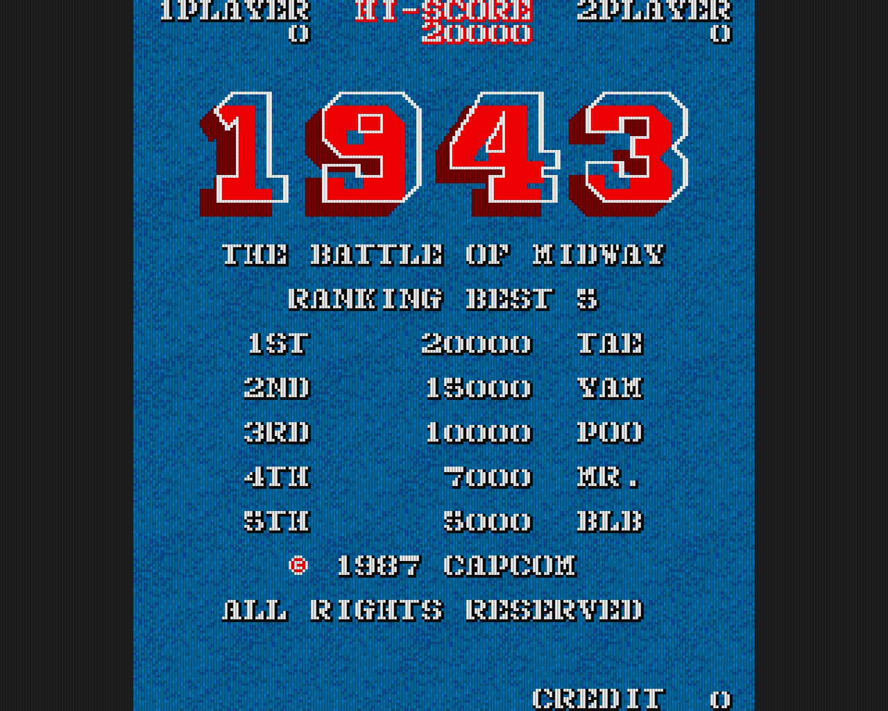
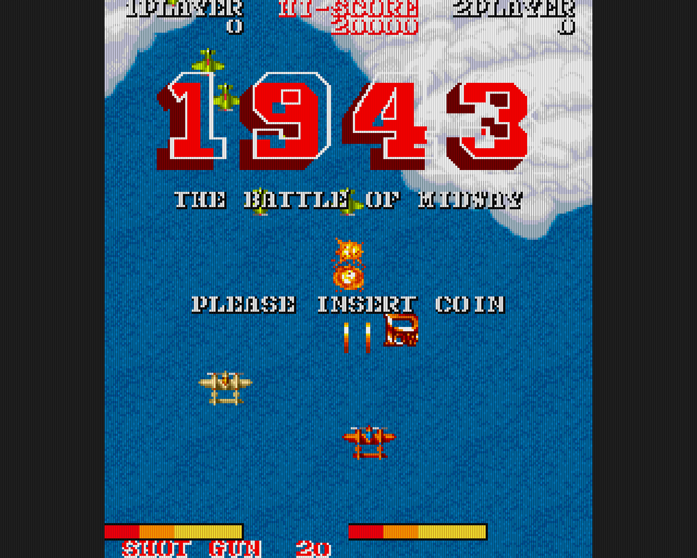

FPGA_1943 - Verilog re-implementation of the arcade game
========================================================

FPGA_1943 re-implements the famous arcade game from CAPCOM : 1943, the battle of midway.

Since the hardware is very close, games like Commando, Black Tiger, Gun Smoke or Side Arms could be supported.

Features
--------

- Uses the TV80 Z80 core.
- Very small implementation.
- Run out of one 16-bit SDRAM running at 72 MHz.
- One background 32x32 tile layer (16 colors).
- One foreground 32x32 tile layer (16 colors).
- One 8x8 character layer (4 colors).
- One sprite generator that handles 128 sprites (16 colors).
- Security chip is implemented.
- Two upscaling schemes : Scale2X or CRT grid with blooming (see the snapshots).
- The ROMs are not included with the core, graphics ones must be translated in a more core friendly format.
- Sound is missing :-(

Files in this Repository
------------------------

#### README.md

You are reading it right now.

#### hdl/top_1943.v

This is the top level of the 1943 hardware.

#### hdl/sdram_ctrl.v

Simple 4-port SDRAM controller.

#### hdl/bram/mem_dc_*.v

Different RAM blocks used in register files and FIFOs implementation.

#### hdl/gpu/gpu_top.v

Top level of the 1943 GPU.

#### hdl/gpu/gpu_gpios.v

Inputs / outputs registers (joysticks, DIP switches, coins, security).
It also contains specials flags to configure the scandoubler / scaler.

#### hdl/gpu/gpu_vbeam.v

Video beam generator, NTSC compatible in the bus clock domain (72 MHz).
1280 x 1024 @ 60 Hz compatible in the video clock domain (108 MHz).

#### hdl/gpu/gpu_dmaseq.v

DMA sequencer that schedules SDRAM access for the Z80 CPUs, the sprite generator and the tilemaps.

#### hdl/gpu/gpu_tilemap.v

Tilemap address generator (for map and graphics), X/Y flip handling and video FIFO.

#### hdl/gpu/gpu_sprites.v

Sprites registers, X/Y comparators, address generator for graphics, X/Y flip handling and dual video FIFO.

#### hdl/gpu/gpu_charmap.v

Character RAM, address generator for graphics and video FIFO.

#### hdl/gpu/gpu_colormux.v

Layers multiplexer, palette index generator.

#### hdl/gpu/gpu_scale2x.v

Scale2X upscaler.

#### hdl/gpu/gpu_scandoubler.v

Scandoubler that does CRT emulation with blooming.

#### hdl/tv80/

Folder containing the TV80 core (https://opencores.org/projects/tv80).

#### verilator/clock_gen/

Configurable clock generator for Verilator.

#### verilator/video_out/

Configurable video output recorder for Verilator.

#### verilator/easy_bmp/

EasyBMP object used by the video output recorder.

#### verilator/sdr_sdram/

Configurable SDR SDRAM C++ model for Verilator.

#### verilator/compile.sh

Compile script for the Verilator testbench.

#### verilator/main.cpp

Main loop of the Verilator testbench.

#### verilator/tb_top.v

Verilator testbench configuration file.

#### conv_gfx/

Quick and dirty arcade ROM graphics converter.

Some snapshots :-)
------------------

Ranking :

Atract mode :

